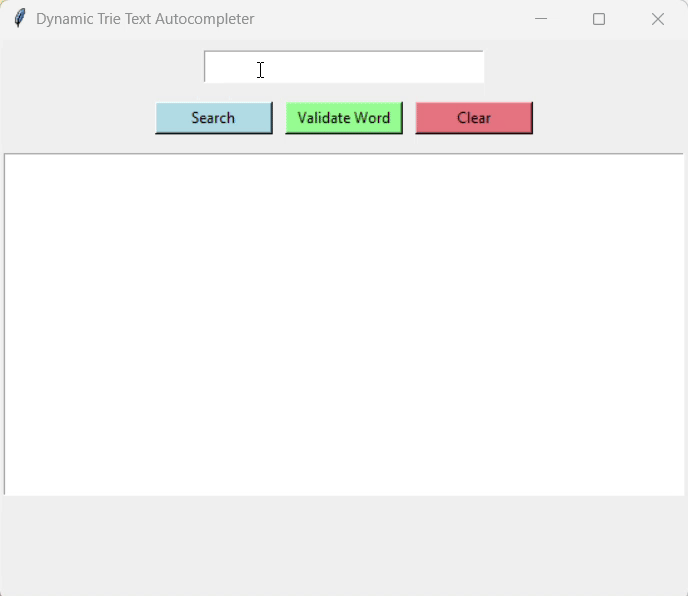

# 🔤 Dynamic Trie Text Autocompleter (Tkinter GUI)

A Python project that implements a **Trie (prefix tree)** data structure with a simple **Tkinter-based GUI**.  
This app allows you to:

- **Autocomplete words** dynamically as you type  
- **Search** for words by prefix  
- **Validate** whether a word exists in the dictionary  
- **Clear** the input/output area  

The project uses the [`english-words`](https://pypi.org/project/english-words/) package for its word dataset.

---

## 🚀 Features
- **Trie Implementation**  
  Efficient data structure for storing and searching words.  
- **Dynamic Autocomplete**  
  Suggestions update in real-time as you type.  
- **Word Validation**  
  Checks if a word exists in the dataset.  
- **Interactive GUI**  
  Built with Tkinter, user-friendly interface.  

---

## 🎥 Demo



Typing `hel` will suggest words like:

```
Autocomplete:
hello
help
helmet
...

✔ 'hello' is a valid word.
✘ 'hel' is NOT a valid word.
```

---

## 🛠️ Installation

1. **Clone this repository**
   ```bash
   git clone https://github.com/your-username/dynamic-trie-autocompleter.git
   cd dynamic-trie-autocompleter
   ```

2. **Set up a virtual environment** (optional but recommended)
   ```bash
   python -m venv venv
   source venv/bin/activate   # On Linux/Mac
   venv\Scripts\activate      # On Windows
   ```

3. **Install dependencies**
   ```bash
   pip install tkinter english-words
   ```

   > Note: Tkinter usually comes pre-installed with Python. If not, install it via your package manager.

---

## ▶️ Usage

Run the script:

```bash
python main.py
```

This will launch the Tkinter GUI.  
Start typing in the input box to see autocomplete suggestions and validation results.

---

## 📂 Project Structure
```
dynamic-trie-autocompleter/
│
├── main.py                         # Main application with Trie + GUI
├── Dynamic-Text-Autocompleter.gif  # Demo GIF
├── README.md                       # Documentation
```

---

## 📖 How It Works

1. **Trie Construction**  
   - Words from the `english-words` package are inserted into a Trie data structure.  
   - Each node stores children and a flag marking if it ends a word.  

2. **Autocomplete**  
   - DFS traversal is used to collect all words starting with a given prefix.  

3. **Word Validation**  
   - Checks if a complete word exists in the Trie, not just a prefix.  

4. **GUI**  
   - Tkinter provides:
     - Input box (real-time updates)  
     - Buttons for Search, Validate, and Clear  
     - Text box for results  

---

## ✅ Example

- Input: `world`  
  ```
  Autocomplete:
  world
  worldview
  worldwide

  ✔ 'world' is a valid word.
  ```

- Input: `abcd`  
  ```
  No matches.

  ✘ 'abcd' is NOT a valid word.
  ```

---

## 🧩 Requirements
- Python 3.8+  
- Tkinter  
- english-words  

---

## 📜 License
This project is licensed under the **MIT License**.  
Feel free to use, modify, and distribute it as you like.  

---

## 🤝 Contributing
Pull requests are welcome!  
If you find issues or have feature requests, please open an issue on GitHub.

---


